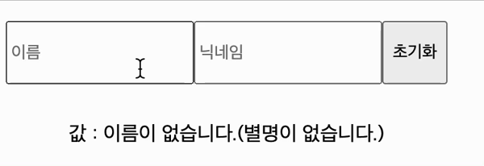
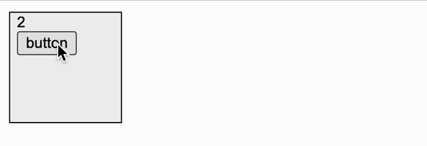
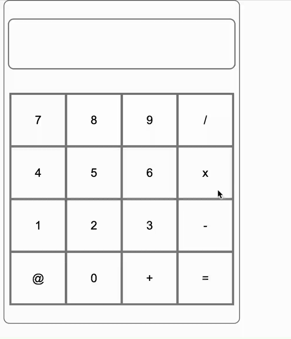

# 멋쟁이 사자처럼 10기 FE 4주차 과제 🦁

반갑습니다 여러분!!☺️ 
벌써 react의 정말 재밌는! 필수적인 요소인 hooks를 다뤄보는 시간입니다!

# 실습 1번문제
 InputSample 컴포넌트는 name과 nickname을 입력받아서 render시키는 컴포넌트 입니다. 해당 기능을 수행하기 위해 주석이 있는 부분을 채워 기능을 완성시켜 봅시다<br> 
 <br> 
 <br> 

주석을 채워서 name과 nickname 을 입력받아 봅시다!
해당하는 페이지는 /component/input 페이지 입니다.
 
ex) <br>

<br>
현재 상태입니다.<br>

https://user-images.githubusercontent.com/77886826/167908055-e3287bcf-5176-4188-8222-0773abc215d5.mov

### 해결방안
```JavaScript

function InputSample() {
  const[name, setName] = useState("");
  const[nickname, setNickname] = useState("");
  const onChange1 = (e) => {
    console.log(e.target.value); 
    setName(e.target.value);
  };

  const onChange2 = (e) => {
    console.log(e.target.value); 
    setNickname(e.target.value);
  };

  const onReset = () => {
    setName("")
    setNickname("")
  };

  return (
    <div>
      <InputWrapper>
        <input
          name="name"
          placeholder="이름"
          onChange={onChange1}
        />
        <input
          name="nickname"
          placeholder="닉네임"
          onChange={onChange2}
          
        />
        <button onClick={onReset}>초기화</button>
      </InputWrapper>

      <ViewWrapper>
        값 : {name === '' ? "이름이 없습니다." :  name} 
        ({nickname === '' ? "별명이 없습니다." : nickname})
        </ViewWrapper>

    </div>
  );
}

export default InputSample;

# 이름에는 이름값을, 닉네임에는 닉네임 값을 집어넣는 코드를 작성해야 합니다.
<br>
리액트에서는 함수형 컴포넌트에서도 상태를 관리할 수 있게 되었습니다. UseState라는 함수를 이용하여 컴포넌트에서 바뀌는 값을 관리할 수 있게 되었습니다.
name과 nickname값을 변수로 받습니다. 여기서 onChange1 은 name의 값을, onChange2는 nickname의 값을 세팅하는 함수입니다.
onchange는 이벤트의 한 종류로서 이벤트 객체 e를 피라미터로 받아와서 사용하게 되는데 이 객체의 e.target은 이벤트가 발생한 input의 value값, 즉 e.target.value를 조회하면 현재 input에 입력한 값이 무엇인지 알 수 있게 해줍니다.
<br>
여기서는 name과 nickname값을 알 수 있는 것이죠. 여기서 나온 값을 useState에서 관리를 해주는 것입니다.
onClick={onReset}은 버튼을 누르게 되면 0으로 초기화 해주는 함수입니다.

<br>
한편 값을 넣지 않았을 때에는 삼항연산자를 이용하였습니다.
```JavaScript
값 : {name === '' ? "이름이 없습니다." :  name} 
        ({nickname === '' ? "별명이 없습니다." : nickname})
```


https://user-images.githubusercontent.com/103018984/174475573-dde0e16b-457a-4974-b20a-869640647949.mov


# 실습 2번문제
우리를 아주 거슬리게 하는 경고가 있습니다...ㅠ


경고를 직접 읽어보시고 문제를 해결해주세요!! 해당 오류를 읽어보면 useEffect의 deps에 count가 없다고 하는데 과연...?!

<br>
 ### 목표)
 해당 button을 클릭할 때마다 숫자가 count되어 올라가도록 만들어주세요!(오류 수정후에도)
 해당 경고의 발생원인과 해결방법을 꼭 적어주세요!
 해당 경고를 완벽하게 지워주세요!! 

### 제한조건 

 - 해당 문제는 useState 와 useEffect를 모두 사용해야 합니다.
 - useEffect의 deps에 해당하는 부분에서 eslint를 무시하는 방법은 사용하면 안됩니다.


# 실습 3번문제
 대망의 끝판왕 계산기 컴포넌트를 제작합니다!
 어떤 방법을 사용하셔도 괜찮습니다. 이번에는 통상적으로 알고있는 계산기로서의 기능이 다 들어가 있기만 하면 됩니다!! 디자인에 너무 부담가지지 않으셔도 좋습니다.<br>
 


https://user-images.githubusercontent.com/77886826/168815930-c19399fc-e6b8-43e8-a4ea-3402948e370c.mov


### 제한조건 
 - useState와 useEffect를 필수적으로 사용합니다.
 - @ 버튼을 클릭할때 저장된 연산식이 초기화 됩니다. 
 - 계산결과가 나올때마다 화면에 표시해야 합니다.
 
+) 통상적인 연산 순서를 반영해서 계산식을 완성시킨다면 선착순 한명은 특별한 상품이 나갑니다. (ex) 3 + 4 * 5 = 23) 
 
# 제출시 필수 사항
- 실습 모든 문제를 포함합니다.
- 실습의 각 문제마다 스크린샷을 포함합니다.
- pr 의 제목은 | [내이름] 제목 |으로 합니다.
ex) [이성인] 리엑트는 너무 재밋어

# 제출 사진






